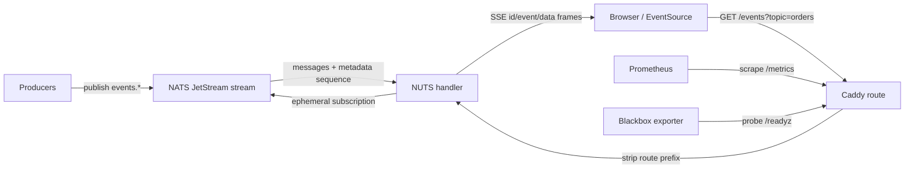
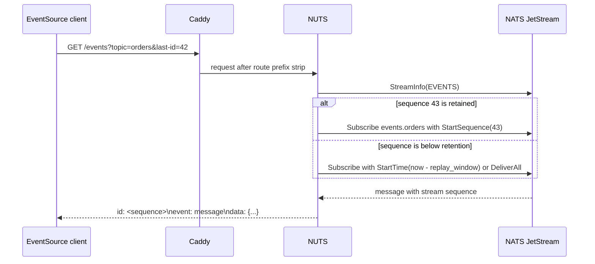

# Architecture

NUTS is a Caddy HTTP handler that turns retained NATS JetStream messages into
browser-friendly Server-Sent Events. It keeps the transport deliberately small:
Caddy owns HTTP routing and edge policy, NATS owns persistence and fan-out, and
NUTS bridges the two with one long-lived NATS connection per handler instance.

## System Diagram

## Request Flow

1. Caddy matches the configured route and should strip the public route prefix
   before the request reaches `nuts`.
2. NUTS handles `/livez`, `/readyz`, `/healthz`, and CORS preflight requests
   before opening any JetStream subscription.
3. For a stream request, NUTS builds a stream plan from either repeated
   `?topic=` query parameters or path shorthand such as `/orders/new`.
4. NUTS applies `topic_prefix`, de-duplicates topics, validates topic syntax,
   and chooses a replay mode from `last-id` or `Last-Event-ID`.
5. NUTS creates an ephemeral JetStream subscription and writes SSE frames until
   the client disconnects, the handler shuts down, the client is too slow, or a
   replay cap is reached.

## Replay Flow

If JetStream has already purged the requested sequence, fallback replay is used.
`replay_window` bounds fallback by time and `replay_max_messages` bounds it by
count. Without either setting, fallback replays all retained messages for the
requested subject.

## State And Ownership

| State | Owner | Notes |
| --- | --- | --- |
| HTTP route matching, TLS termination, subscriber auth | Caddy / edge proxy | Put auth before `nuts` so rejected clients do not create JetStream consumers. |
| Event persistence, stream retention, NATS auth | NATS JetStream | Streams must exist before Caddy provisions NUTS. |
| Browser replay cursor | Browser / client | Native `EventSource` sends `Last-Event-ID` automatically after reconnect. |
| Active SSE connection count | NUTS process | Enforced by `max_connections` per handler instance. |
| Metrics and structured logs | NUTS + Caddy | Metrics are exported through Caddy's Prometheus handler. |

## Compatibility Notes

NATS 2.10+ supports multi-filter consumers. When the connected server supports
that feature, NUTS creates one consumer with all requested subjects. Older NATS
servers use a common wildcard subscription and in-process filtering to preserve
multi-topic behavior without duplicate delivery.

## Security Boundary

NUTS authenticates to NATS; it does not authenticate browser subscribers.
Subscriber identity, sessions, and tenant policy belong in Caddy route policy,
`forward_auth`, an upstream reverse proxy, separate route blocks, or separate
streams/prefixes. CORS is a browser read policy, not authorization.
