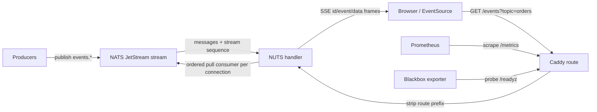
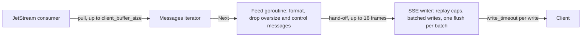
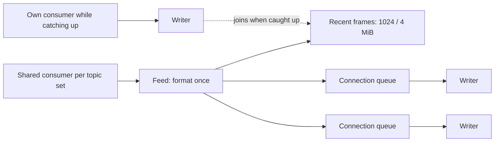
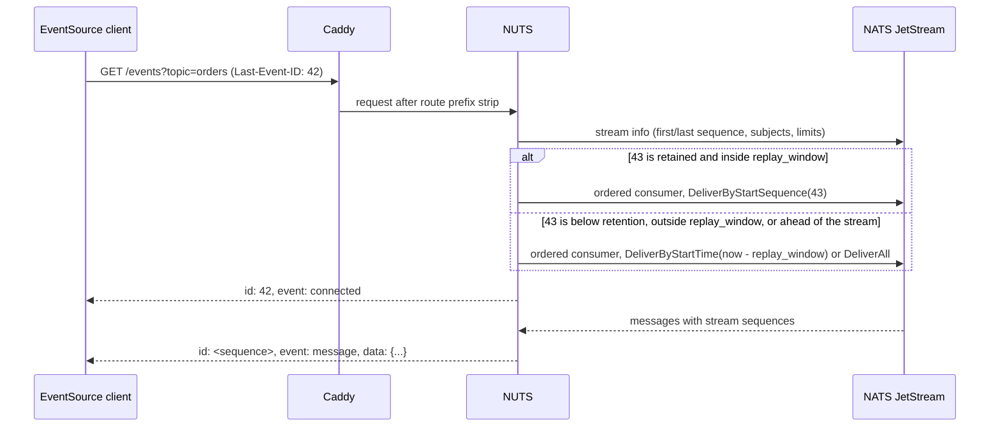

# Architecture

NUTS is a Caddy HTTP handler that turns retained NATS JetStream messages into
browser-friendly Server-Sent Events. It keeps the transport deliberately small:
Caddy owns HTTP routing and edge policy, NATS owns persistence and fan-out, and
NUTS bridges the two with one long-lived NATS connection per handler instance
and one JetStream consumer per SSE connection.

## System Diagram

## Request Flow

1. Caddy matches the configured route and should strip the public route prefix
   before the request reaches `nuts`.
2. NUTS answers `/livez`, `/readyz`, `/healthz` (with or without a trailing
   slash) and CORS preflight requests before touching JetStream.
3. For a stream request, NUTS builds a stream plan from either repeated
   `?topic=` query parameters or path shorthand such as `/orders/new`.
4. NUTS applies `topic_prefix`, de-duplicates topics, validates topic syntax,
   checks subscriber JWT topic claims when configured, and reads the replay
   cursor. A valid `Last-Event-ID` header wins over `?last-id=`.
5. NUTS refuses the request as retryable when NATS is disconnected or
   `max_connections` is reached (see README "Transient failures and
   EventSource").
6. NUTS reads the stream's info once: its first and last sequence, its
   subjects, its consumer limits and, for a replay under `replay_window`, the
   publish time of the resume point. It rejects topics outside the stream's
   subjects and picks the start position.
7. NUTS creates an ordered pull consumer for the request and streams SSE
   frames until the client disconnects, the handler shuts down, a write misses
   `write_timeout`, a replay cap is reached, or the consumer cannot be
   recreated.
8. When the stream ends, NUTS deletes the consumer in the background and
   releases the `max_connections` slot at once.

## Delivery Pipeline

- **Backpressure.** The feed goroutine hands up to 16 formatted frames ahead
  and then waits for the writer, and the iterator pulls more only as its
  prefetch drains. A slow client therefore slows its own consumer; the backlog
  waits in JetStream, not in NUTS memory. Per-connection memory is bounded by
  `client_buffer_size` prefetched messages plus 18 frames on their way: one
  in the feed, 16 handed off and the batch being written (formula in
  [PERFORMANCE.md](PERFORMANCE.md)).
- **Batching.** The writer takes a frame and whatever frames are already
  waiting, until it holds 32 frames or passes 64 KiB, writes them and flushes
  once, under one write deadline. A batch only holds frames that are already
  there, so it adds no latency; it saves a flush and a syscall per frame
  during bursts and replays.
- **Slow clients.** A client that stops reading is detected when a write
  misses `write_timeout` (30 s by default). The stream closes with
  `disconnect_reason=slow_client` and the client resumes from its last event
  ID.
- **Recovery.** The ordered consumer tracks the last stream sequence it
  delivered. After a consumer-sequence gap, a NATS reconnect, missed pull
  heartbeats (`nats_idle_heartbeat`) or a consumer deleted on the server, it
  recreates itself from the next sequence, so the SSE stream continues without
  a hole. Recreations are counted in
  `nuts_consumer_invalidated_total{reason="recreated"}`. If recreation keeps
  failing, the stream closes with `disconnect_reason=consumer_unrecoverable`.
- **Start positions.** Requests without a cursor start at an explicit
  `LastSeq + 1` rather than `DeliverNew`: an ordered consumer that resets
  before its first message re-applies its original deliver policy, and
  `DeliverNew` would then skip everything published during the outage.
- **Cleanup.** Consumers are deleted when their stream ends. On shutdown or
  reload, Cleanup wakes every stream and waits up to 3 seconds for their
  deletes before closing the NATS connection. The consumer's
  `InactiveThreshold` (30 s, or the stream's consumer limit when lower) is the
  backstop when NUTS cannot delete it.

### Shared subscriptions

With `shared_subscriptions` on, connections that are caught up with the live
stream share one ordered consumer per topic set:

- A connection without a cursor joins at once, after the stream position its
  `connected` event names. A connection with a cursor replays on its own
  consumer; when that consumer has nothing pending, it joins, and the frames
  the shared subscription delivered in the meantime come from the ring.
  Joining requires every message after the connection's last one to be in
  the ring or still to come; otherwise it keeps catching up alone.
- Each connection has a queue of `client_buffer_size` frames. When a queue is
  full, that connection leaves the shared subscription and continues on its
  own consumer right after the last frame it was given; the others are not
  held up. When every connection has left, the shared consumer is deleted.
- Hand-offs go by stream sequence, and frames at or below a connection's last
  sequence are skipped, so nothing is delivered twice or skipped.

Fallback replay is used when JetStream no longer holds the requested sequence,
when the cursor is older than `replay_window`, when the cursor is ahead of the
stream (a recreated or restored stream), and, with `replay_window`, when the
stream info cannot be read. `replay_max_messages` bounds how many historical
messages one connection replays; live messages published after the request
arrived never count against it. Without either setting, retained replay is
unbounded.

The SSE `id` is always the stream-wide JetStream sequence, also on multi-topic
streams. A multi-topic request uses one consumer with every requested subject
as a filter and one start sequence, so ids increase monotonically across
topics and across reconnects, with gaps where other subjects' messages sit in
the stream.

## State And Ownership

| State | Owner | Notes |
| --- | --- | --- |
| HTTP route matching, TLS termination, subscriber auth | Caddy / edge proxy | Put auth before `nuts` so rejected clients do not create JetStream consumers. |
| Event persistence, stream retention, NATS auth | NATS JetStream | Streams must exist before Caddy provisions NUTS. |
| One consumer per SSE connection | NATS JetStream, created and deleted by NUTS | Counts against the stream's `max_consumers` (1000 by default from nats-server 2.15). |
| Browser replay cursor | Browser / client | Native `EventSource` sends `Last-Event-ID` automatically after reconnect. |
| Active SSE connection count | NUTS process | Enforced by `max_connections` per handler instance. |
| Metrics and structured logs | NUTS + Caddy | Metrics are exported through Caddy's Prometheus handler. |

## Compatibility Notes

NUTS needs nats-server 2.10 or newer: every stream uses a consumer with
server-side `FilterSubjects`. Multi-topic subscriptions need 2.14.7 or newer
(2.15 recommended); older servers can skip messages on one subject when
another is purged or rolled up, and NUTS warns at startup when connected to
one. From 2.15, streams accept 1000 consumers unless `max_consumers` is set.
See README "Compatibility".

## Security Boundary

NUTS authenticates to NATS separately from browser subscriber access. Subscriber
identity and tenant policy can live in Caddy route policy, `forward_auth`, an
upstream reverse proxy, separate route blocks, separate streams/prefixes, or the
optional `subscriber_jwt_key` check with JWT `subscribe` topic claims. CORS is a
browser read policy, not authorization.
